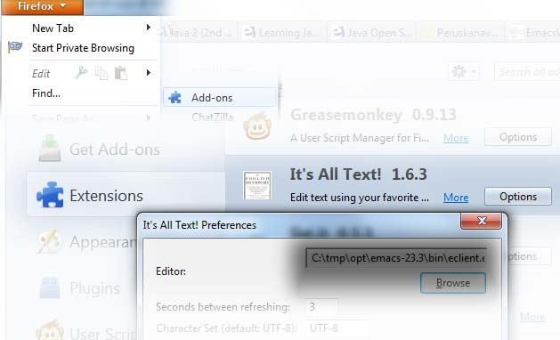
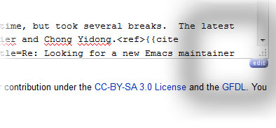

Using Windows Emacs to edit forms in Firefox
============================================

Windows Firefox can call Emacs when you want to edit a text area in Web
page more confortable. Want to edit Wikipedia article in Emacs? Howabout
writing contact feedback form in a Web page using Emacs editor? It's possible.

Project Homepage: <https://github.com/jaalto/project--windows-emacs-client-for-firefox>

Requirements
------------

* `Emacs for Windows <https://pinboard.in/u:jariaalto/t:emacs/t:software>`_
* `Cygwin for Windows <http://cygwin.com>`_.
  Install gcc, make and other build tools
* `Firefox for Windows <http://firefox.com>`_.
* `It's All Text <https://addons.mozilla.org/en-US/firefox/addon/4125>`_
  Firefox extension.

Installation
------------

1. Copy the *.bat file in this project to Emacs installation directory
   in Windows that is named ``bin/``.

2. Start Cygwin shell.

3. Compile and install the helper which the Firefox extension
   *It's all text* will call ::

   make ROOT="c:/your/path/to/emacs-23.3/bin" all install

4. In Firefox menu *Add-ons*, select "options" for extension "It's all text"
   and point it to compiled ``eclient.exe``

That's it. Visit wikipedia, and you should be able to edit the page by
clicking the blue "edit" icon that appears on mouse hover near the lower
right corner of the text input area.

